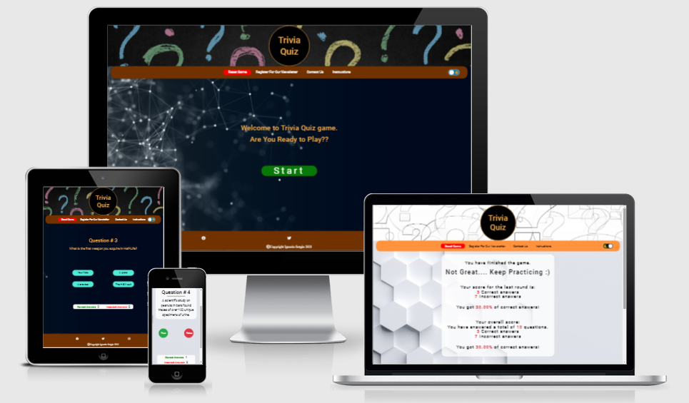
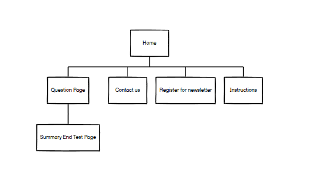
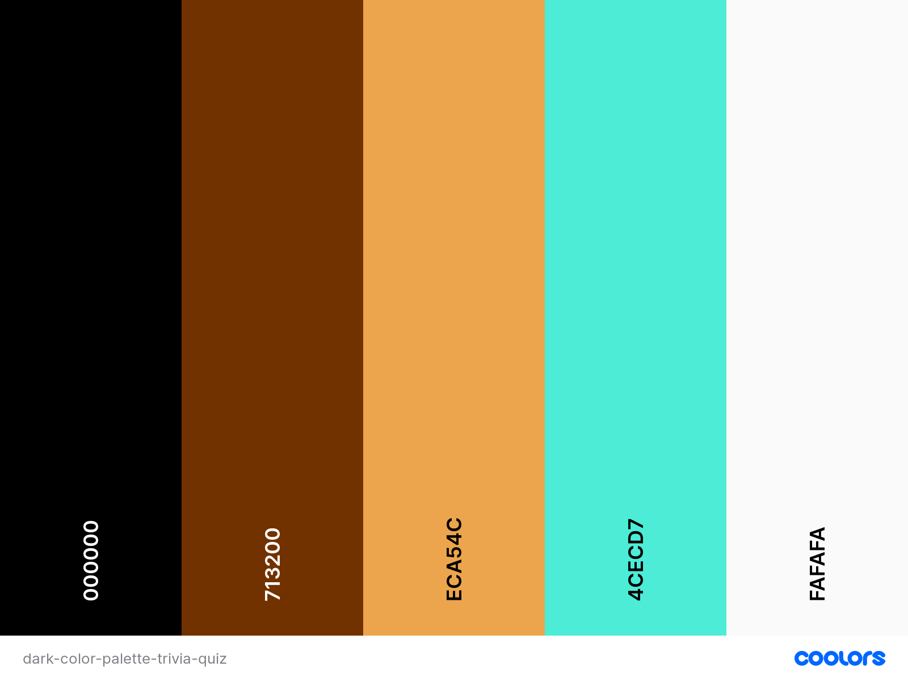
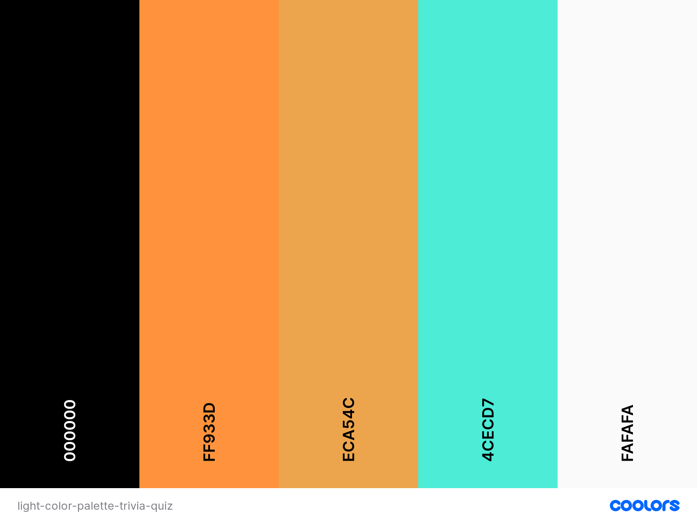

---
## Trivia Quiz
---  

Trivia Quiz is a website designed to entertain and encourage the users to test their knowledge on different fields or subjects, answering different questions, challenging themselves to improve their performance with different difficulty levels.    
Before starting the game the user will be able to choose the category and the level of difficulty and then will start the question challenge. The question type is chosen randomly from the remote api, and can be a True/False or a multiple choice.  

  

The goal is to build a simple website where the user will want to spend time playing in, share with friends and learn some new notions. The owner goal overtime is to gain exposure, promoting new challenges, selling advertising space, developing the range of games, creating a database of users giving them the choice if they like to be contacted info regarding new features or upcoming challenges.  
The owner goal is to get as many people as he can to play on his website, and get the company name promoted through user social media sharing.  

---  

> - ### Content
>> - [Website Structure](#website-structure) 
>> - [User Stories](#user-stories)  
>> - [Design Choices](#design-choices)
>> - [Wireframes](#wireframes)
>> - [Tecnologies Used](#tecnologies-used)
>> - [Features Implemented](#features-implemented)
>> - [Future Implementations](#future-implementations)

## Website Structure   
The Trivia Quiz website is composed of one homepage and the registration for newsletter page. The links present in the navbar connect to the registration modal, a modal with the contact form and also a modal for the game instructions. All links can be opened without refreshing the game page, in case the user doesn't want to quit his current game.
  
  ---
    
   
  ---  
 In the screen is also present a switch to change between Light and Dark Theme. From the homepage the user can choose to start the game, that will open a category choice screen and then the difficulty choice screen.  
 After the selections are made there will be a countdown form 3 to 0 before the first question is displayed. After the round of questions the user will be present with a result summary of his performance with the options to share on Twitter or Facebook, continue the game or reset the game starting a new session with the reset button.
 
The website has a simple structure with only 1 pages, all the links in the navbar are connected to modals.  

---

## User Stories  
Find the user stories in [this link](./assets/docs/user-stories-trivia-quiz.pdf).  
Find the trade-offs in [this link](./assets/docs/strategy-plane-trivia-quiz.pdf).  

1. As a user I play Trivia Quiz to relax and learn new information about topics I'm interested in.
1. As a user I like to be able to choose which category the questions are related to.
1. As a user I like to choose the Difficulty Level.
1. As a user I like to see the score and information during and at the end of the game.
1. As a user I play Trivia Quiz to test and improve my knowledge.
1. As a user i like to be able to change background color to dark or light mode for a more relaxing game.
1. As a user I like to share my results on social media platforms.
1. As a user i want to be able to contact the owner to give feedback.
1. As a owner I create an interactive Trivia Quiz Website to attract and entertain people on my website.
1. As a owner i want my website to have appealing design and color theme choice to make the user experiense more pleasant and enjoiable.
1. As a owner I create Trivia Quiz to enable people to challenge one another sharing their best results.
1. As a owner I create Trivia Quiz contact form to allow client to contribute with game improvements ideas.
1. As a owner i want to create a newsletter registration form to allow users that wish to do so to enter they details. 
1. As a owner i want my website to have links to the main social media.   
1. As a owner i want my website to have a contact form to allow user to leave feedbacks.  
1. As a owner i want my website to have a light/dark mode button to allow user to choose the theme they prefer.

## Future possible implementations:  
1. Overtime after a good numbers of users promote ads space for sale in the website.  
1. Add a timer to the game to increase difficulty.  
1. Create form where users can add new Q&A to the question database.  
1. Develop a mobile app to play Trivia Quiz, with a offline plane mode.  

---
  
  
## Design Choices
### Fonts:
I have choose Roboto font for the whole website.
### Color Palette:  

As the owner want the user to spend time playing in our website one of the features decided to implement was a Dark/Light mode switch changing color theme depending of the user color preference.  
Color palette images were taken with [coolors](https://coolors.co/).

### Dark Theme:

---  
### Light Theme:
  

---

## Wireframes  
The wireframes were done using [balsamiq](https://balsamiq.com/)  

[Homepage Trivia Quiz](./assets/wireframes/trivia-quiz-wireframes-homepage.pdf)  
[Question Page](./assets/wireframes/trivia-quiz-wireframes-question-section.pdf)  
[End of the Game Page](./assets/wireframes/trivia-quiz-wireframes-end-of-game-section.pdf)  
[Category and Difficulty level modals](./assets/wireframes/wireframes-category-difficulty-level-modals.pdf)  
[Registration and Contact forms](./assets/wireframes/registration-and-contact-form-wireframes.pdf)  

---  
## Tecnologies Used  

### Languages:
* HTML to create the elements in the page
* CSS to style the elements
* javascript to add functionality to the website 

### Libraries:  
* Bootstrap to style the elements
* Google Fonts for the Roboto font
* Font Awesome for the icons
* jQuery to simplify javascript code  

### Tools:
* [Github](https://github.com/) 
    * Git was used for version control and Gitpod.io to develop and push to the repository.    
* Chrome developer tool  
* Microsoft Word
    * Microsoft Word for User Stories Sheet
* [Balsamiq](https://balsamiq.com/) for wireframes  
* [EmailJs](https://www.emailjs.com/)  
    * emailJs was used to link the contact form and the register for newsletter form to a email address. The registration form also send an automatic message to the user email.  
* [Open Trivia database](https://opentdb.com/api_config.php)
    * Open Trivia Database is a free JSON api used for import questions and answers
* [SweetAlert](https://sweetalert.js.org/)  
    * SweetAlert was used to display popup messages   
* [favicon generator](https://www.favicon-generator.org/search/)  
    * Used to create the favicon fo the title  
* [coolors](https://coolors.co/)
    * Used to create the color palette  
* [Am I responsive?](http://ami.responsivedesign.is/)  
    * Used to generate the mockup image [mockup-trivia-quiz.png](./assets/docs/mockup-trivia-quiz.png)  
---

## Features Implemented
* Responsive mobile first design.
* Clear instruction for a user friendly experience  
* Created an interactive quiz game
* Created a registration form for newsletter with an automatic email sent to the user to confirm his/her subscription using EmailJs service
* Implemented category questions selection
* Implemented difficulty level questions selection
* Added links to social media platforms
* Created a contact form connected to gmail using EmailJs service
* Implemented theme choice with a switch to toggle dark/light mode
* Added Score summary at the end fo the game providing user information about his/her performance with info about last round odf questions and the overall session
* Added a button for sharing the result through Twitter or Facebook   
--- 
### Future Features  
* Promote deals to sell ads spaces on the website  
* Add a timer to the game  
* Create a form to create new Questions and Answers and add them to the database  
* Add to the pages Popup windows with tips and suggestions to help the user thorough the game  
* Develop an app to play trivia quiz offline 
--- 

## Testing  
### Validation services:
* W3C HTML validator  
[HTML Result](./assets/docs/validator-results/result-html-validator.png)
* W3C CSS validator  
[CSS Result](./assets/docs/validator-results/result-css-validator.png)
* JSHint for javascript  
[script.js Result](./assets/docs/validator-results/script.js-result-validator.png)  
[sendEmail.js Result](./assets/docs/validator-results/sendEmail.js-result-validator.png)
* Chrome DevTools Lighthouse

Find the testing informations in a separate file [testing.md](.assets/docs/testing.md)

---   

## Bugs 
I managed the bugs found through the issues section on the github repository. 
Following the steps to trigger and report the bug:
1. Give Short bug description.
1. Steps to trigger the bug:
* Click the element
* What expect to happend
* Error
1. Description of the unwanted behevior.  

---

## Deployment
This project was developed using gitpod.io workspace, using git to push it into Github remote repository. 
This is the procedure that I follow to deploy the final version to Github pages:  
1. Open Chrome browser on my Computer  
1. Navigate to github.com
1. Log in with my name and password to access my repositories
1. On the top left, in the search function input "Trivia Quiz" to find repository
1. Click on "IgnazioSotgiu/trivia-quiz" to open repository
1. Click on the Settings link on the repository menu
1. Scroll down to the Github Pages section
1. In the source button select Branch: master
1. Once the Branch is selected save the changes with the button on the right
1. The project has now been deployed
1. After the page has been refreshed scroll down to Github pages section again to find the link to the live website https://ignaziosotgiu.github.io/trivia-quiz/
1. Click on the link to navigate to the website  
### Running Trivia Quiz Locally
1. Navigate to Github.com
1. Navigate to "IgnazioSotgiu/trivia-quiz" repository  
1. Click on "IgnazioSotgiu/trivia-quiz" to open repository
1. Click on the Code button
1. Select copy the URL in the dropbox
1. Open your favourite IDE and select source
1. Paste the URL and  then you can navigate through the repository files

to clone the repository input this command:
git clone https://github.com/IgnazioSotgiu/trivia-quiz.git

## Credits
---
### Images
* Favicon generated with [favicon generator](https://www.favicon-generator.org/search/)  
* Homepage  
Background image dark theme:  
<a href='https://pngtree.com/free-backgrounds'>free background photos from pngtree.com</a>  
Header background dark theme:  
https://www.freepik.com/free-photo/color-interrogation-symbols_973682.htm#page=1&query=question%20mark&position=3    
Background image light theme:  
Image by <a href="https://pixabay.com/users/artturi_mantysaari-1625672/?utm_source=link-attribution&amp;utm_medium=referral&amp;utm_campaign=image&amp;utm_content=1562743">Artturi Mäntysaari</a> from <a href="https://pixabay.com/?utm_source=link-attribution&amp;utm_medium=referral&amp;utm_campaign=image&amp;utm_content=1562743">Pixabay</a>  
Header background light theme:  
Image by <a href="https://pixabay.com/users/geralt-9301/?utm_source=link-attribution&amp;utm_medium=referral&amp;utm_campaign=image&amp;utm_content=1090829">Gerd Altmann</a> from <a href="https://pixabay.com/?utm_source=link-attribution&amp;utm_medium=referral&amp;utm_campaign=image&amp;utm_content=1090829">Pixabay</a>  
* Contact form image 
Icon by <a href='https://iconpacks.net/?utm_source=link-attribution&utm_content=1204'>Iconpacks</a>  
* Registration form image
Icon by <a href='https://iconpacks.net/?utm_source=link-attribution&utm_content=7039'>Iconpacks</a> 
### Tutorials:  
* To build the countdown sequence before the questions:  
https://www.youtube.com/watch?v=vSV_Ml2_A88  
* To build the dark/light toggle switch:  
https://www.youtube.com/watch?v=xodD0nw2veQ  
* To build the sharing toggle button at the end of the game page:  
https://www.youtube.com/watch?v=YcEshVZNA5E&t=526s
## Acknowledgements:  
I receive inspiration and guidance for this project from:

* Code Institute   

Special Thanks to mentor Narender Singh.