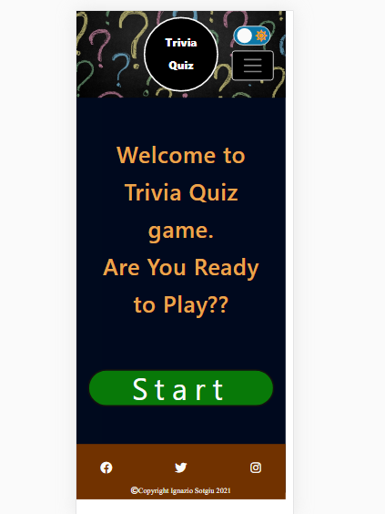
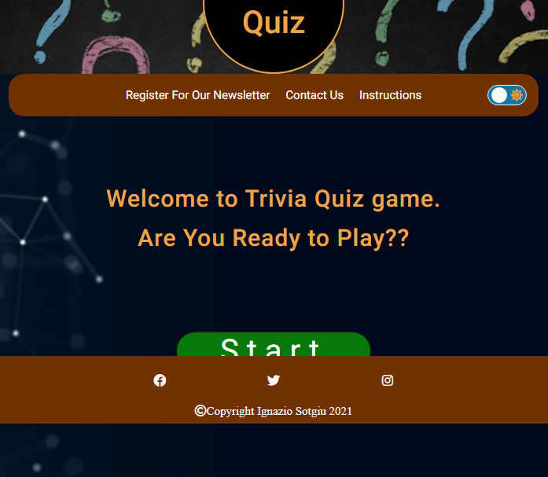
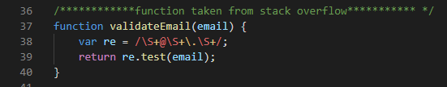
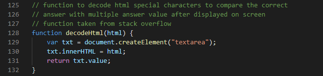
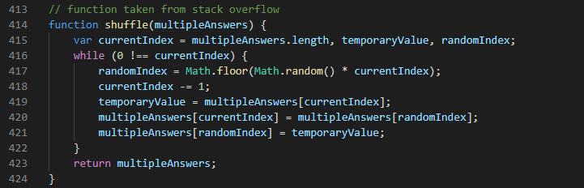
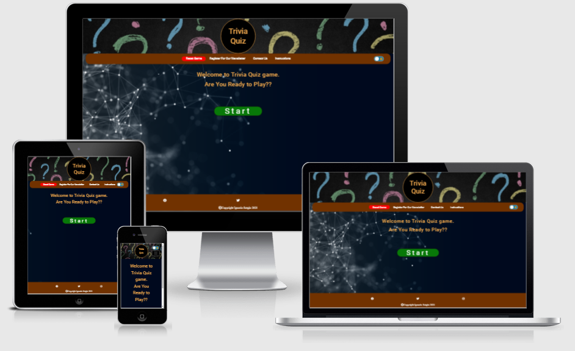
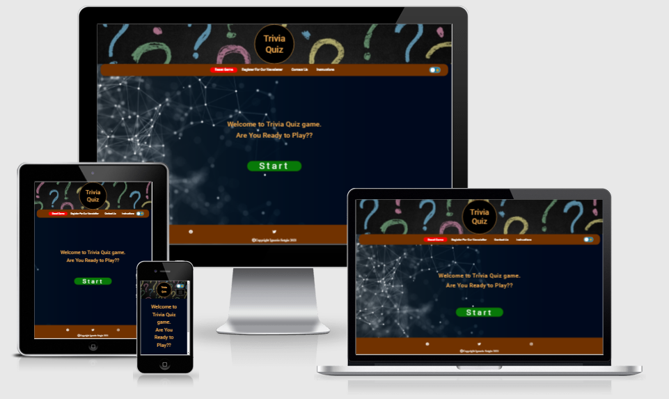
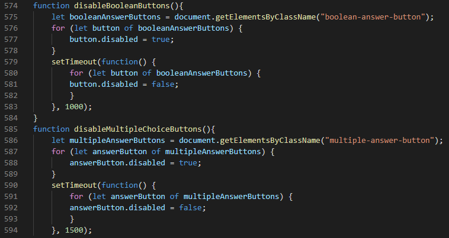
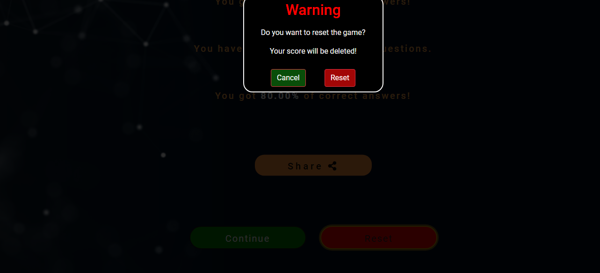

## List of bugs found:  

### Bug #1

1.  **Give Short bug description:**  
On mobile device only a white vertical band appear in the screen on the right for the full height of the page also a white space appear at the bottom of the page for the full width of the screen 
1.  **Steps to trigger the bug:**  
    1. Open the website https://ignaziosotgiu.github.io/trivia-quiz/  with chrome browser 
    1. Open chrome developer tool  
    1. Select mobile view with the icon on the top left of developer tool windows  
1. **Description of the unwanted behaviour:**  
    A white band appear on the right and on the bottom of the mobile screen  
       
1. **Solution found:**  
    Find a solution on stack overflow website:  
    Added overflow-x hidden and relative position for html and body  

### Bug #2  

1.  **Give Short bug description:**  
    Website footer doesn't stay on the bottom of the page. 
1.  **Steps to trigger the bug:**  
    Open the website https://ignaziosotgiu.github.io/trivia-quiz/    
1. **Description of the unwanted behaviour:**  
    The footer stays in the middle of the page  
       
1. **Solution found:**  
    Find a solution on stack overflow website:  
    1. Added relative position to the html and body elements  
    1. Added absolute position to the footer  
    1. Added bottom 0 to the footer to stick to the bottom of the page  

### Bug #3   

1.  **Give Short bug description:**  
    When email is entered on registration and contact form the email is sent even if the email address is invalid 
1.  **Steps to trigger the bug:**  
    1. Open the website https://ignaziosotgiu.github.io/trivia-quiz/   
    1. Select Register for Newsletter or Contact Us link on the navigation menu 
    1. Enter a name in the form  
    1. Enter an invalid email address
    1. Tick the registration box or write a message in the Contact Us form  
    1. The email is sent successfully message appear  
1. **Description of the unwanted behaviour:**  
    The email is sent with an invalid email address   
1. **Solution found:**  
    Find a solution on stack overflow website:  
    Added the validateEmail function in sendEmail.js to check for valid email address for both Registration and Contact Us form 
      

### Bug #4    

1.  **Give Short bug description:**  
    When getting the questions array from the API I store the correct answer value in correctAnswer variable.
    The issue happened when some html characters are present. For example the ' character is store in the variable as #&039 t=from the API. The answer value selected from html page will store the character as ' .When the program will compare the answer selected by the user with the correct answer stored in the variable the 2 value will be considered different and the program will count an incorrect answer even if the user would have selected the correct choice.
1.  **Steps to trigger the bug:**  
    1. Open the website https://ignaziosotgiu.github.io/trivia-quiz/   
    1. Select Start button
    1. Select a category 
    1. Select a difficulty level
    1. Go through the questions  
    1. The issue will happen when a special html character is present in the correct answer value  
1. **Description of the unwanted behaviour:**  
    The message will display incorrect even if the answer was correct  
    The incorrect answer count will be updated accordingly 
1. **Solution found:**  
    Find a solution on stack overflow website:  
    Added decodeHtml function to store the value of correct answer in html element and then store it from there into the correctAnswer variable. This way both answer will be read from html elements so the value will match in case of a correct answer.
        

### Bug #5    

1.  **Give Short bug description:**  
    The correct answer always display in the same button
1.  **Steps to trigger the bug:**  
    1. Open the website https://ignaziosotgiu.github.io/trivia-quiz/   
    1. Select Start button
    1. Select a category 
    1. Select a difficulty level
    1. Go through the questions   
1. **Description of the unwanted behaviour:**  
    The correct answer is always the bottom right button 
1. **Solution found:**  
    Find a solution on stack overflow website:  
    Passing the multipleAnswer array thorough the shuffle functions will assign each array value a random position.
        

### Bug #6    

1.  **Give Short bug description:**  
    The welcome message and start button in the homepage doesn't stay at the center of the screen.
1.  **Steps to trigger the bug:**  
    1. Open the website https://ignaziosotgiu.github.io/trivia-quiz/   
    1. In bigger screens the message stays on the top part of the page  
1. **Description of the unwanted behaviour:**  
    The message should stay in the center of the page but when the screens is large the user can see the message staying on top leaving a large part of the screen empty.
     
1. **Solution found:**  
    Using flexbox I was able to get responsive positioning of the message depending of the size of the screen used.
      

### Bug #7    

1.  **Give Short bug description:**  
    In the game if user clicks quickly the answer button many times the program will count those clicks and add correct/incorrect question count. Also the program will skip question number so the user will have less questions to answer.
1.  **Steps to trigger the bug:**  
    1. Open the website https://ignaziosotgiu.github.io/trivia-quiz/  
    1. Click Start button  
    1. Choose a Category
    1. Choose a Difficulty Level
    1. Wait for the countdown screen to show the first question
    1. Click rapidly a numberof times on any button
1. **Description of the unwanted behaviour:**  
    The game will add a number of clicks to the counter and the game will skip a number of questions 
1. **Solution found:**  
    Deactivate the buttons after the user first click solve the problem. Then adding a timeout to activate the buttons again for the user's next question
       

### Bug #8    

1.  **Give Short bug description:**  
    The warning message after the reset button is clicked doesn't stay in the center of the screen
1.  **Steps to trigger the bug:**  
    1. Open the website https://ignaziosotgiu.github.io/trivia-quiz/  
    1. Click the reset button on the navbar
1. **Description of the unwanted behaviour:**  
    The warning message is not centered. In the reset button in the ent of the game page this behaviour is more noticeable
    
1. **Solution found:**  
    Give warning container position fixed.
     