## User Stories   
Find the user stories in [this link](./user-stories-trivia-quiz.pdf).  
Find the trade-offs in [this link](./strategy-plane-trivia-quiz.pdf).  

1. As a user I play Trivia Quiz to relax and learn new information about topics I'm interested in.  
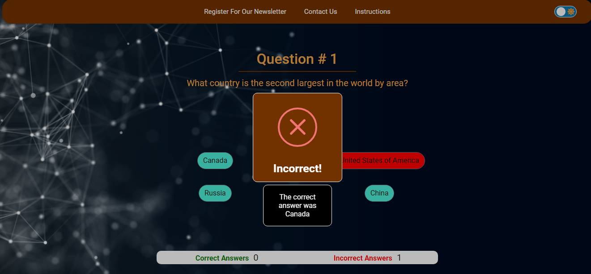
1. As a user I like to be able to choose which category the questions are related to.  
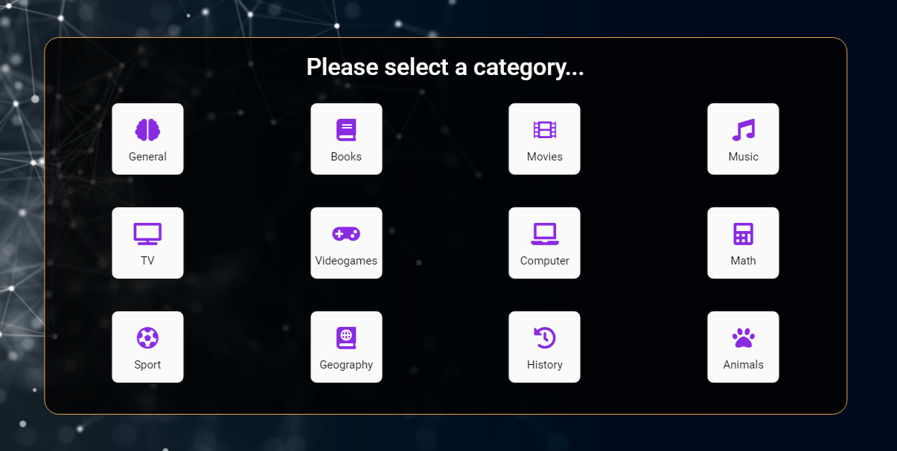
1. As a user I like to choose the Difficulty Level.
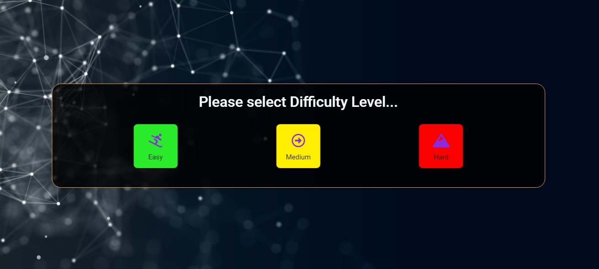
1. As a user I like to see the score and information during and at the end of the game.  
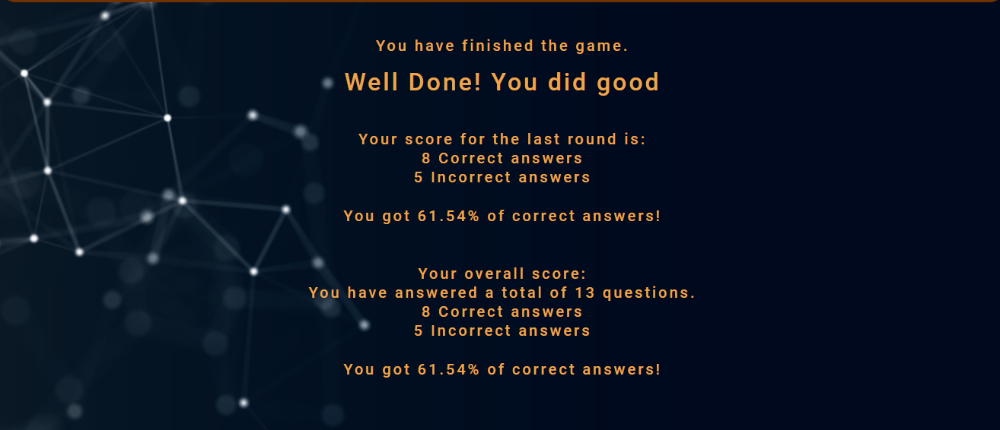  
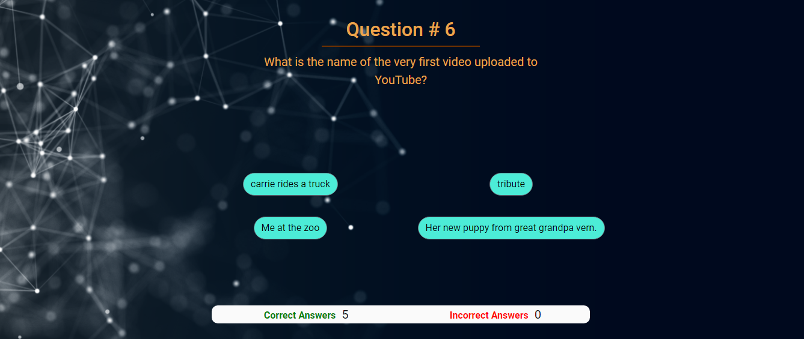
1. As a user I play Trivia Quiz to test and improve my knowledge.  
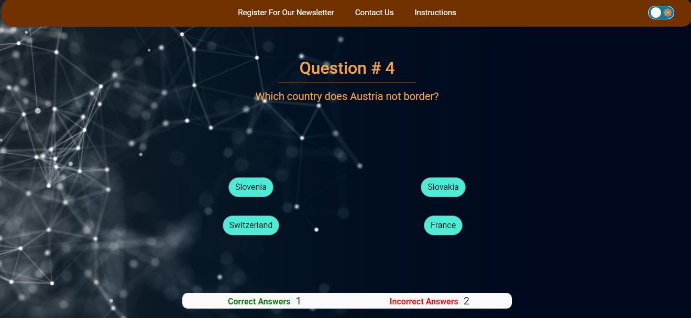
1. As a user I like to be able to change background colour to a dark or light mode for a more relaxing game.  
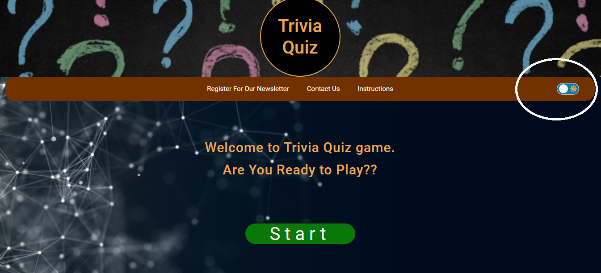
1. As a user I like to share my results on social media platforms.
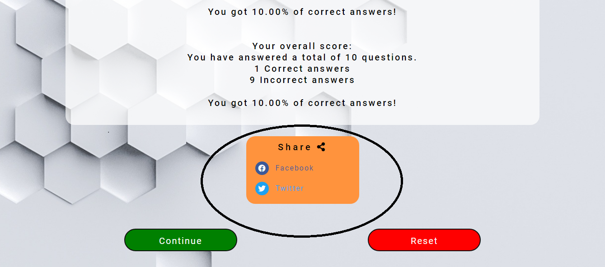
1. As a user I want to be able to contact the owner to give feedback.
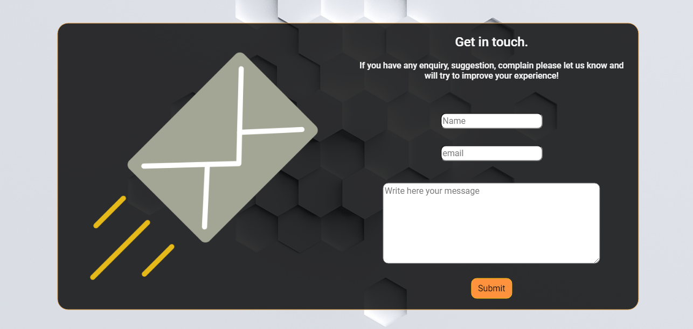
1. As a user I want my score to be saved and loaded for me when I go back to play.
1. As a user I want to be able to reset the score of the game.  

1. As an owner I create an interactive Trivia Quiz Website to attract and entertain people on my website.  
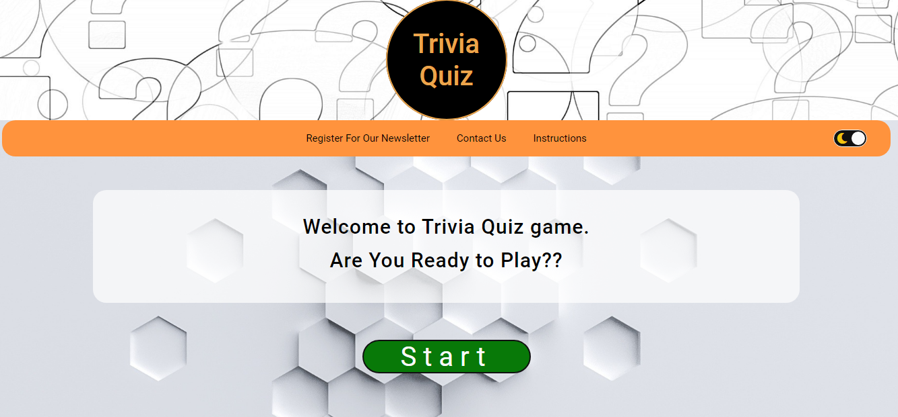
1. As an owner I want my website to have an appealing design and colour theme choice to make the user experience more pleasant and enjoyable.  
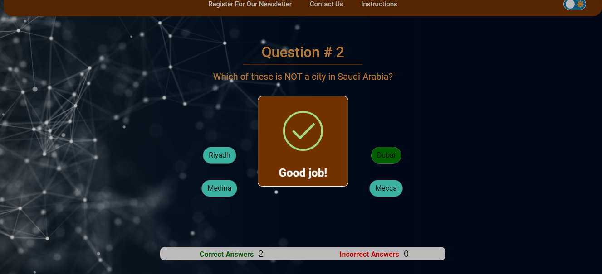
1. As an owner I create Trivia Quiz to enable people to challenge one another sharing their best results.  

1. As an owner I create Trivia Quiz contact form to allow the client to contribute with game improvements ideas. 

1. As an owner I want to create a newsletter registration form to allow users that wish to do so to enter their details.   

1. As an owner I want my website to have links to the main social media.  
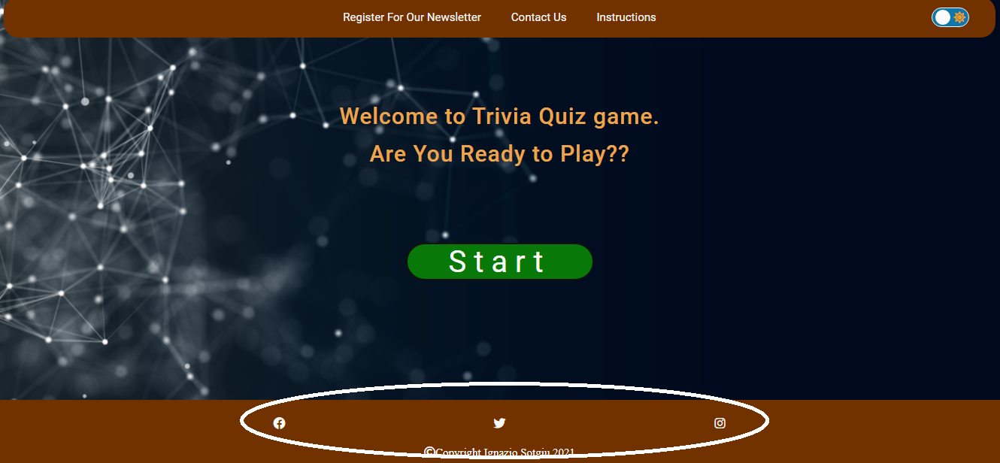
1. As an owner I want a confirmation email to be sent after the registration for the newsletter is successful.
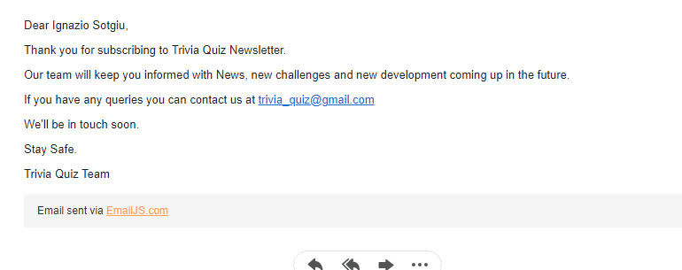
1. As an owner I want my website to have a contact form to allow the user to leave feedback.  

1. As an owner I want my website to have a light/dark mode button to allow the user to choose the theme they prefer.  
  
1. As an owner I want the user's score to be kept until the user will decide to reset it.  
 
1. As an owner I want a warning message to be displayed to warn the user before the score is reset.  
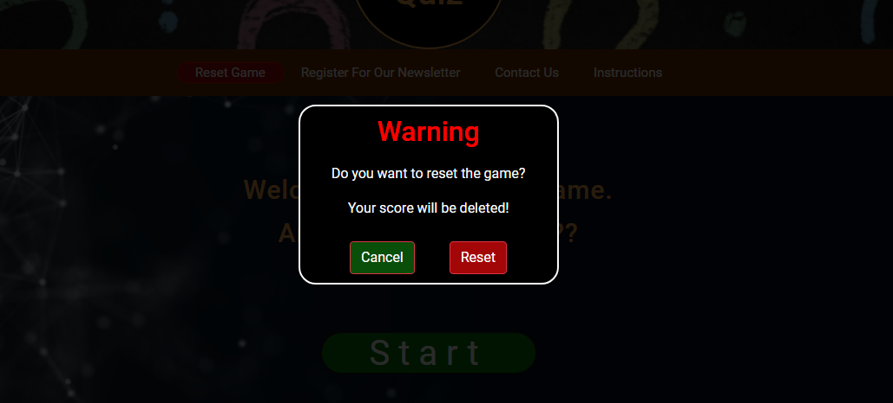 

## Future possible implementations:  
1. Overtime after a good number of users promote ads space for sale on the website.  
1. Add a timer to the game to increase difficulty.  
1. Create a form where users can add new Q&A to the question database.  
1. Develop a mobile app to play Trivia Quiz, with an offline plane mode.  
